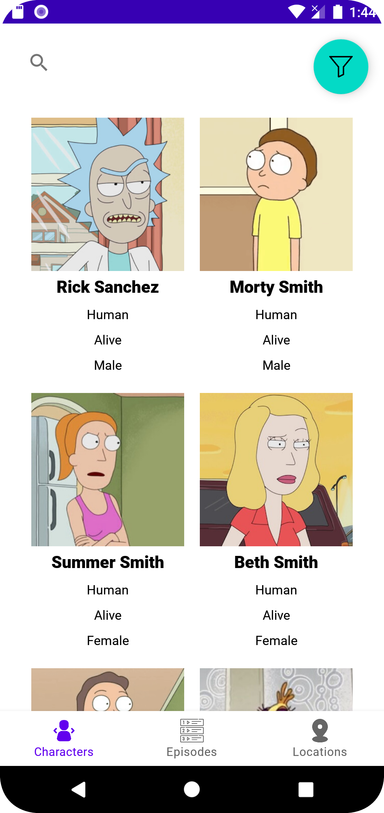
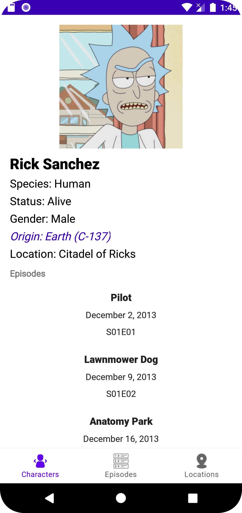
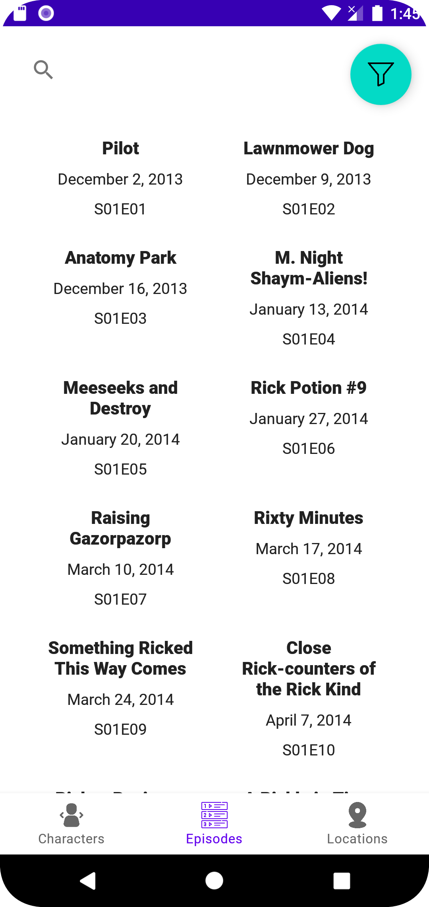
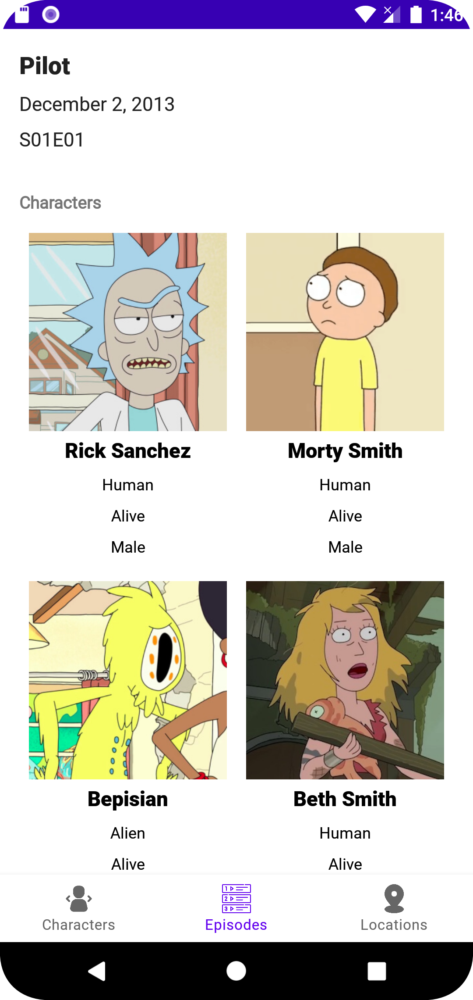
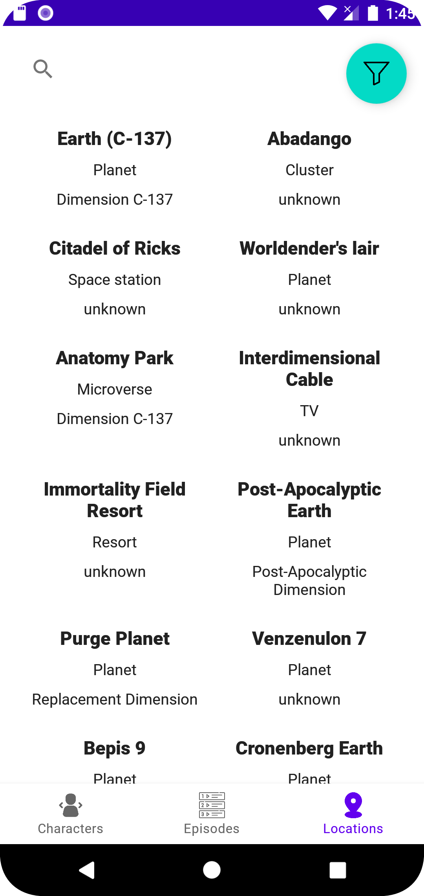
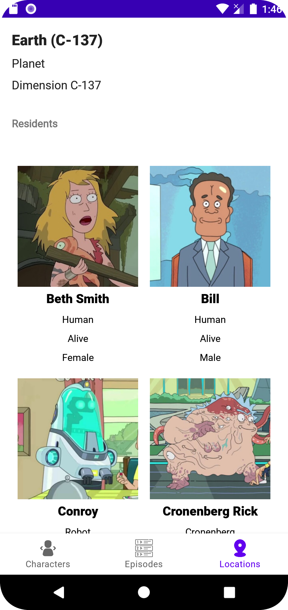

# Rick and Morty Application

Приложение для просмотра информации о персонажах, эпизодах и локациях из вселенной "Rick and Morty".

## Содержание
- [Описание](#описание)
- [Библиотеки](#библиотеки)
- [Паттерны проектирования](#паттерн)
- [Скриншоты](#скриншоты)
- [Установка](#установка)
- [Использование](#использование)
- [Функции](#функции)
- [Требования](#требования)
- [Разработка](#разработка)

## Описание

Это приложение позволяет пользователям просматривать подробную информацию о персонажах, эпизодах и локациях из популярного анимационного сериала "Rick and Morty". 
Приложение предоставляет фильтры и функции поиска для быстрого доступа к нужной информации. В приложении имеется оффлайн-режим, в отсутствии интернета данные которые были кэшированы - показываются на экране, если кэша нет – показывается соответствующее сообщение «Данные не загружены, проверьте интернет-соединение»
Все вкладки имеют Pull-to-Refresh (для обновления данных на экране), а также поддерживают Пагинацию (Pagination)
Используемое API: https://rickandmortyapi.com/ 

## Библиотеки

RecyclerView, Retrofit, Room, Flow & ViewModel, Navigation Component, SplashScreen, SwipeToRefreshLayout, Material Components, Glide, Lottie

## Паттерн проектирования

MVVM (Model-View-ViewModel)

## Скриншоты

### Главный экран


### Детали персонажа


### Список Эпизодов


### Детали эпизода


### Список Локаций


### Детали локации



## Установка

### Клонирование репозитория

Для начала клонируйте репозиторий на свой локальный компьютер:

```bash
git clone https://github.com/ваш_аккаунт/ваш_репозиторий.git
cd ваш_репозиторий

Сборка проекта

    Откройте проект в Android Studio.
    Скачайте все необходимые зависимости, синхронизировав проект с Gradle.
    Соберите проект и установите его на устройство или эмулятор.

```

Использование

После установки приложения на устройство:

    Главный экран: Позволяет выбрать категорию для просмотра: Персонажи, Эпизоды или Локации.
    Фильтрация и поиск: Доступны фильтры и строки поиска для уточнения результатов.
    Детали: Нажмите на любой элемент, чтобы увидеть подробную информацию.

Функции

    Просмотр списка персонажей с фильтрацией по имени, статусу и виду.
    Просмотр списка эпизодов с фильтрацией по названию и номеру серии.
    Просмотр списка локаций с фильтрацией по названию, типу и измерению.
    Функция пагинации для плавной загрузки данных.
    Обновление данных с помощью жеста pull-to-refresh.

Требования

    Android Studio Arctic Fox или выше.
    Android SDK версии 21 или выше.
    Интернет-соединение для загрузки данных.

Основные компоненты

    MainActivity: Главная активность, содержащая навигацию по приложению.
    CharacterFragment, EpisodeFragment, LocationFragment: Фрагменты для отображения списков персонажей, эпизодов и локаций.
    CharacterViewModel, EpisodeViewModel, LocationViewModel: ViewModel для управления данными и состоянием UI.
    CharacterRepository, EpisodeRepository, LocationRepository: Репозитории для получения данных из API и локальной базы данных.
